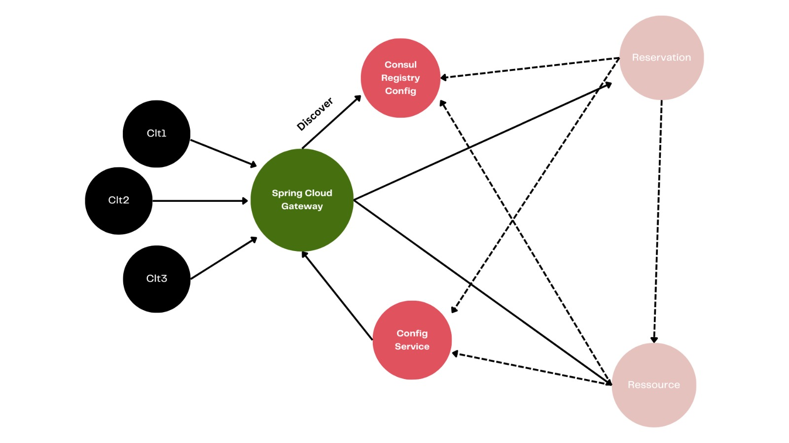
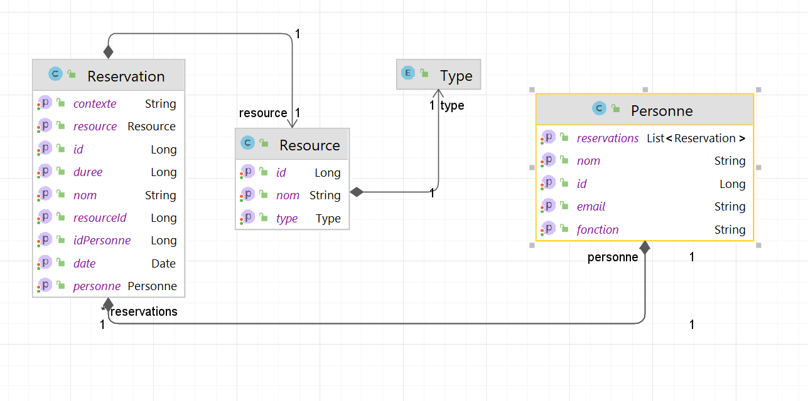
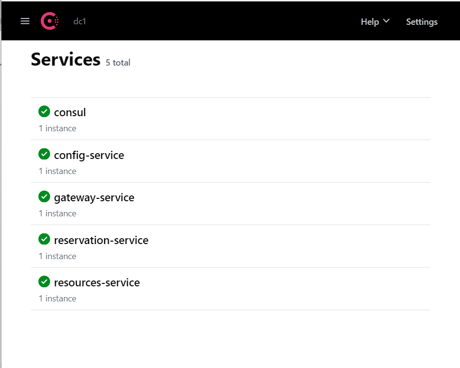
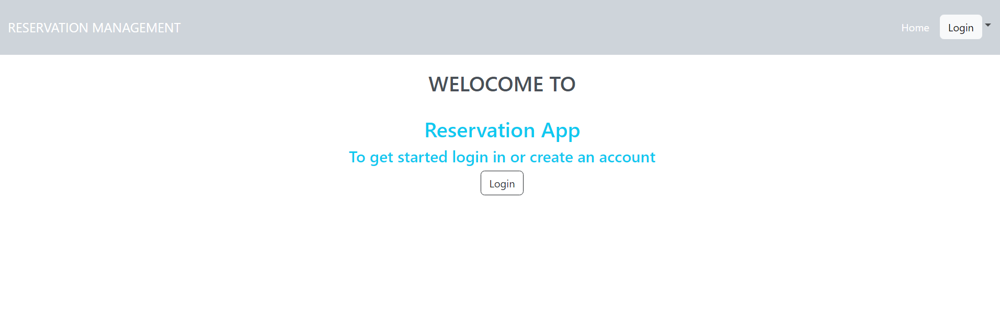
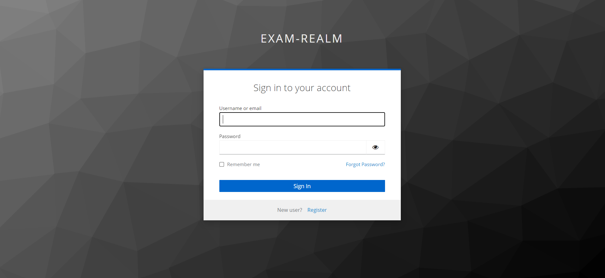
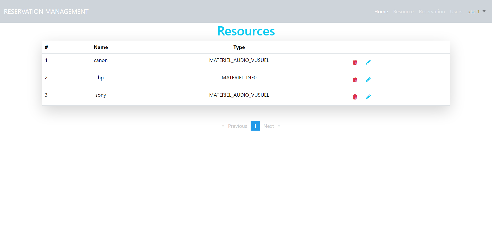
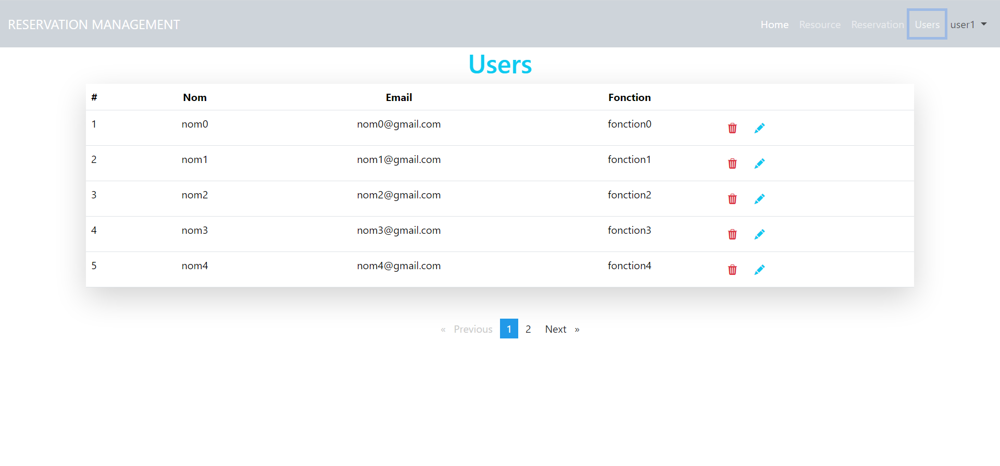
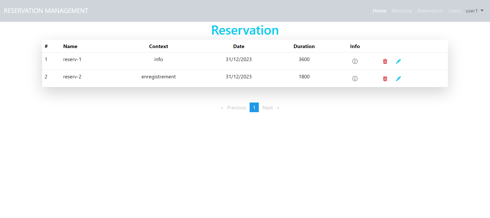
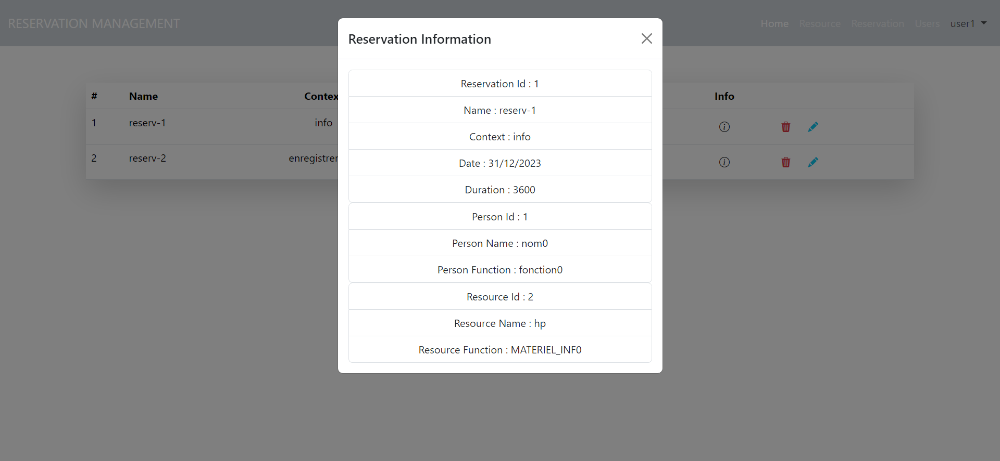

# Reservation Management

## Technologies


## Prerequisites
```

* Spring Cloud
* Consul Dicovery
* H2 DataBase
* Docker Compose
* Keycloak

```

## Project Dependencies
<table>
    <tr>
        <th>Reservation</th>
        <th>Resource</th>
        <th>Gateway</th>
        <th>Configuraion</th>
    </tr>
    <tr>
        <td><a href="https://github.com/anasbn44/reservation-management/blob/b241bdbb61aa4088d91f82103f919c99f13a60e5/reservation-service/pom.xml"></a></td>
        <td><a href="https://github.com/anasbn44/reservation-management/blob/b241bdbb61aa4088d91f82103f919c99f13a60e5/resources-service/pom.xmll"></a></td>
        <td><a href="https://github.com/anasbn44/reservation-management/blob/b241bdbb61aa4088d91f82103f919c99f13a60e5/gateway-service/pom.xml"></a></td>
        <td><a href="https://github.com/anasbn44/reservation-management/blob/b241bdbb61aa4088d91f82103f919c99f13a60e5/config-service/pom.xml"></a></td>
</table>

















